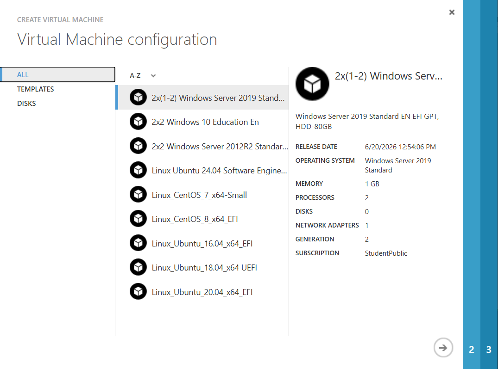
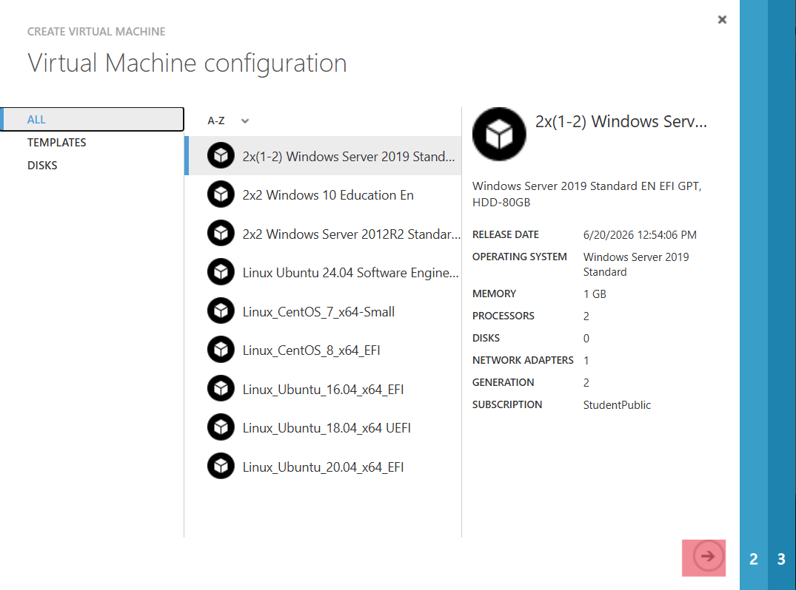
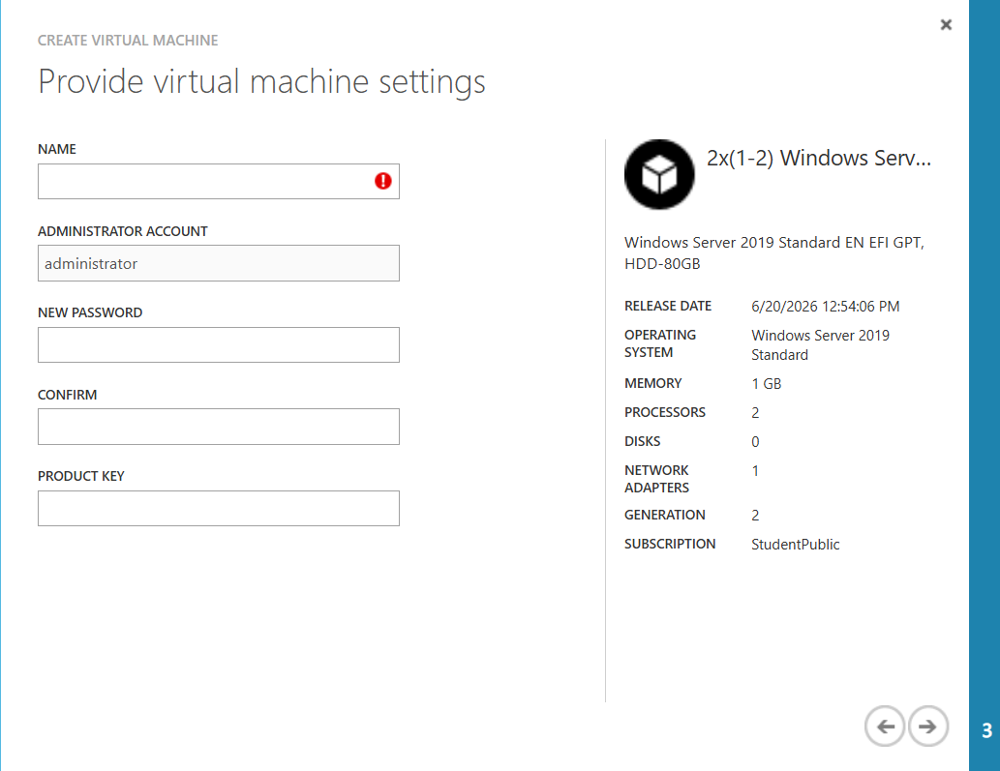
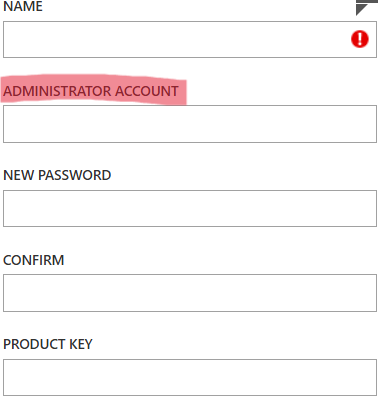
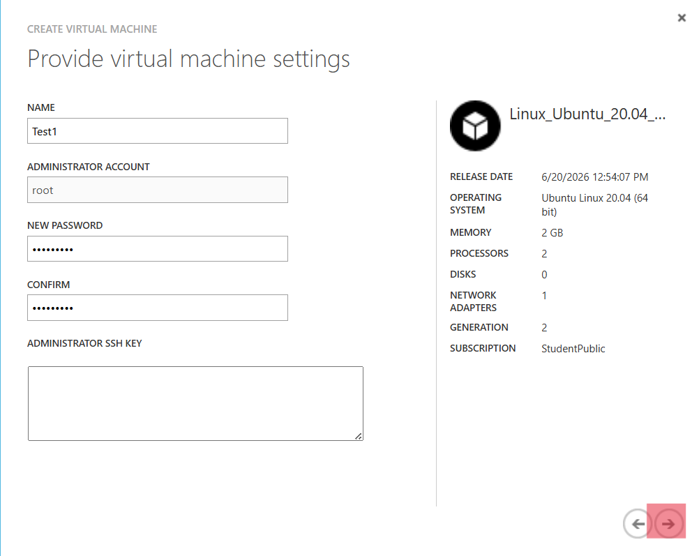
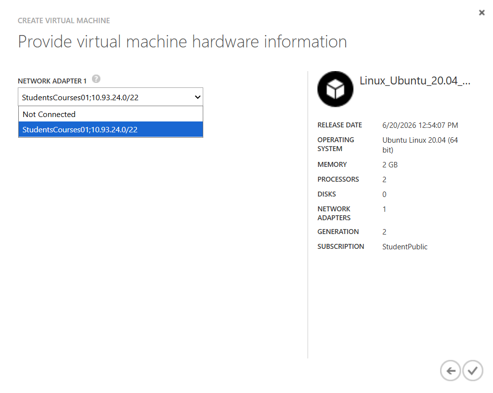
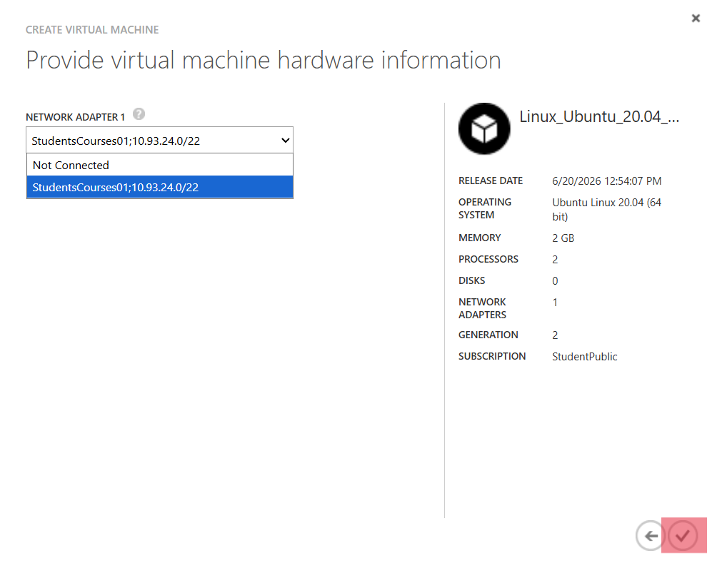

## Как создать новую виртуальную машину из галереи

1. Откроется меню создания из галереи.
   
2. Вы можете выбрать различную операционную систему для вашей виртуальной машины и увидеть детали.
3. Когда выберете, нажмите кнопку со стрелкой вправо.
   
4. Откроется меню настроек вашей виртуальной машины.
   
5. Теперь вам нужно ввести имя вашей виртуальной машины в поле «NAME». Имя обязательно.
6. Введите и подтвердите новый пароль для вашей виртуальной машины.
7. Если вы видите красный восклицательный знак в поле «PASSWORD», условие по паролю не выполнено (см. [Требования к паролю](../../05-reference/01-password-policy/)).
8. Если вы видите красный восклицательный знак в поле «CONFIRM», пароль и подтверждение пароля не совпадают.
9. Поле «ADMINISTRATOR ACCOUNT» может быть заполнено по умолчанию и не может быть изменено. Но в некоторых случаях от вас требуется ввести своё имя в это поле.
   
10. Также вы можете ввести свой SSH-ключ в поле «SSH KEY» или ключ продукта в поле «PRODUCT KEY». Это необязательно.
11. Сохраните свой пароль, учётную запись администратора и SSH-ключ или ключ продукта, так как вы больше не сможете их увидеть.
12. Когда заполните все поля, нажмите кнопку со стрелкой вправо.
    
13. Затем вы можете настроить сетевой адаптер вашей виртуальной машины — где будет доступна ваша VM.
    
14. Теперь вы можете нажать кнопку с галочкой, чтобы сохранить настройки и создать виртуальную машину.
    