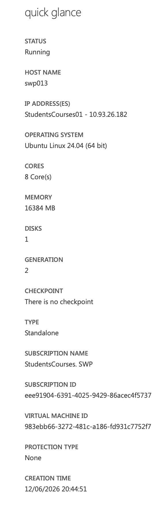
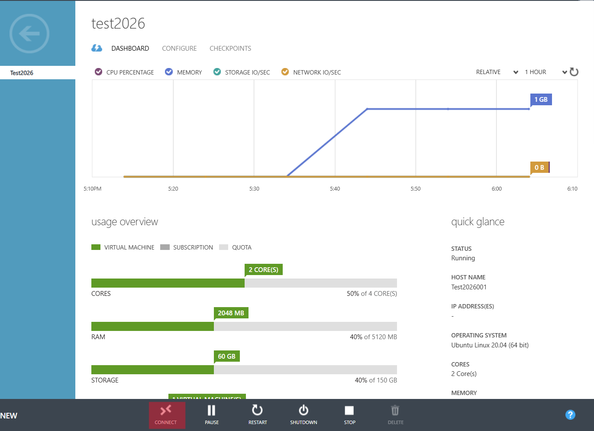
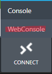
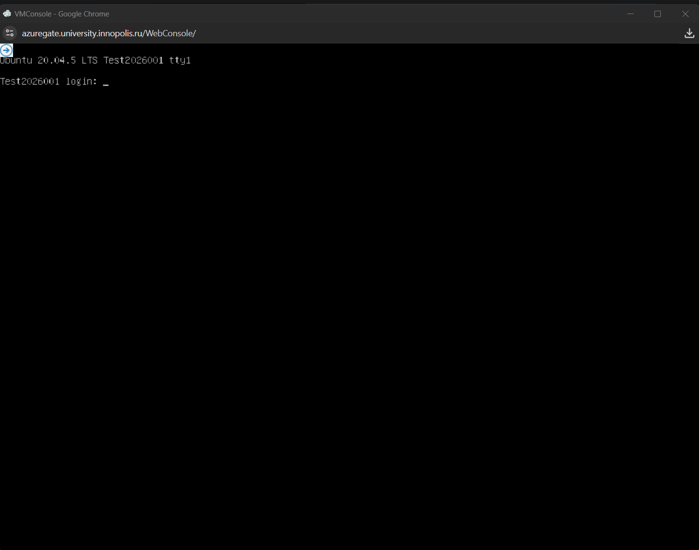
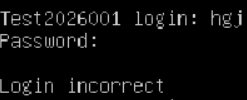
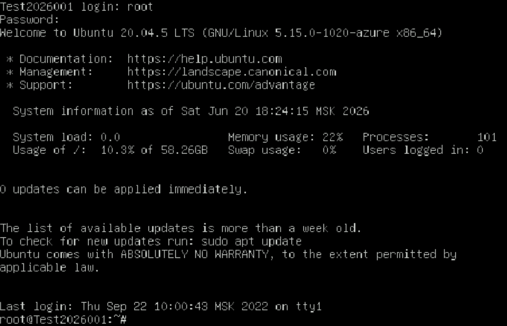

## Как подключиться к вашей виртуальной машине

У вас есть несколько способов подключиться к вашей виртуальной машине:

- Вы можете использовать клиенты или приложения для SSH-подключения. Например, PuTTY для Windows или MobaXterm для Windows, Linux и Mac. Но для этого варианта вам нужно настроить «SSH KEY» во время создания виртуальной машины.
- Вы можете подключиться к вашей виртуальной машине из браузера (см. ниже).
- Подключитесь к вашей виртуальной машине через её IP с помощью другого программного обеспечения (см. ниже).

## Как увидеть IP виртуальной машины

1. На странице вашей виртуальной машины справа вы можете увидеть IP вашей виртуальной машины.
   
2. IP выглядит так: `10.13.127.89`.
   
3. Если нет IP — см. раздел «Как создать виртуальную машину с явным IP» (будет обновлено скоро).

## Как подключиться к вашей виртуальной машине из браузера

1. На странице панели управления вашей виртуальной машины нажмите кнопку «CONNECT» внизу.
   
2. Затем вы можете выбрать два варианта подключения к вашей виртуальной машине, для подключения из браузера нажмите «WebConsole».
   
3. Откроется новое окно браузера с консолью вашей виртуальной машины.
   
4. Вам нужно ввести логин вашей VM (см. [Какой логин моей виртуальной машины](../../03-functions/02-details-login/)) и нажать Enter.
5. Затем вам нужно ввести пароль вашей VM и нажать Enter.
6. Если вы видите сообщение «Login is incorrect». Это означает, что вы ввели неправильный логин или пароль. Попробуйте снова с правильным логином и паролем.
   
7. Если вы успешно подключились к вашей виртуальной машине, вы увидите сообщение «Welcome to Ubuntu...» или что-то подобное, в зависимости от операционной системы вашей виртуальной машины.
   